# ANIME DB Progress: How Things Are Going, How Things Done.

## No.1: 10/26/2024 How Things Are Going
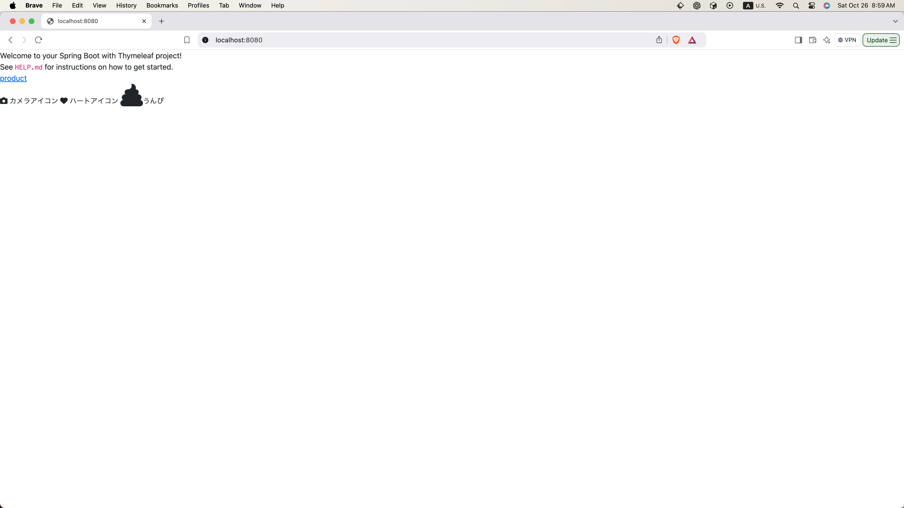
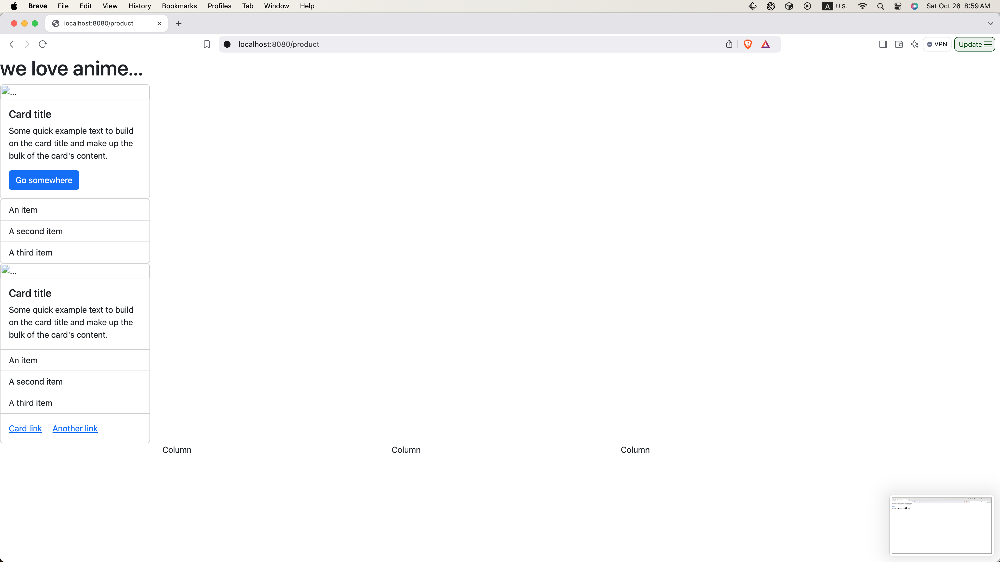
- webjarsを使ってBootStrap, FontAwesome を追加。
- I added BootStrap and FontAwesome by using webjars.
- Bootstrap, webjarsが本当に使えるかテストした。
- I tested out whether Bootstrap and Fontawesome actullaly worked.

## No.2: 10/28/2024 How Things Are Going
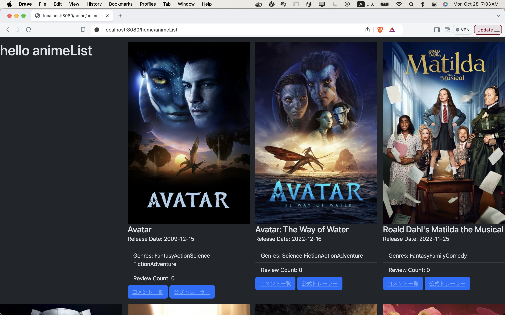

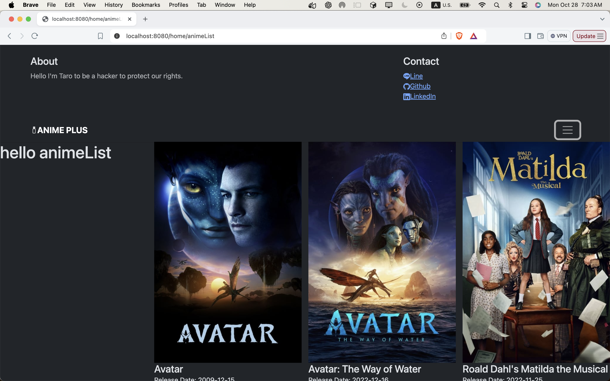
- added data in MongoDB
- created Repository, Model and Service by Spring Boot to fetch the date from MongoDB.
- obtained the data and showed them to the frontend by Thymeleaf.

## No.3: 11/01/2024 How Things Are Going
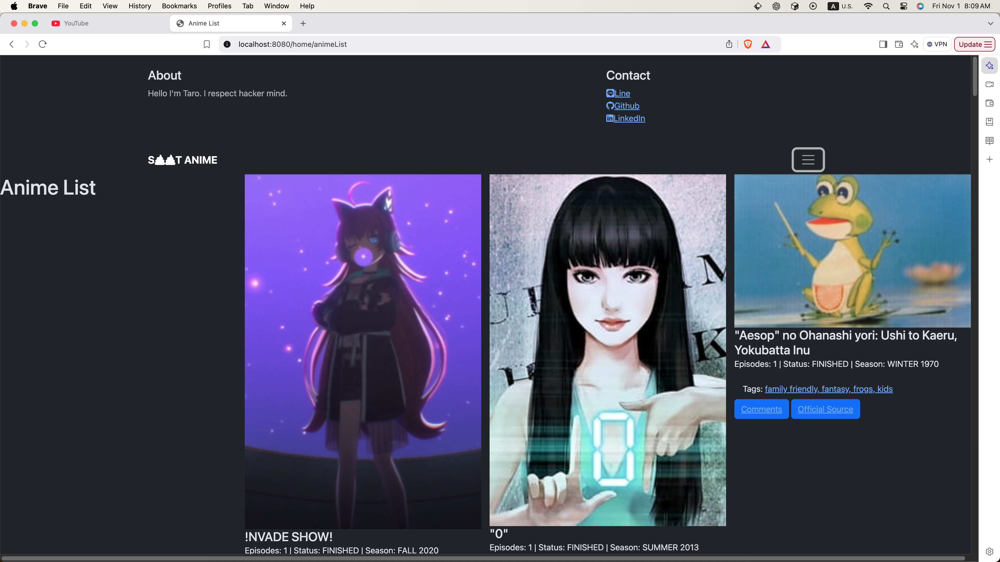

- inserted new data in MongoDB
- chaged the content of model, Thyemeleaf, Controller. 
-
## No.4: 11/18/2024 How Things Are Going
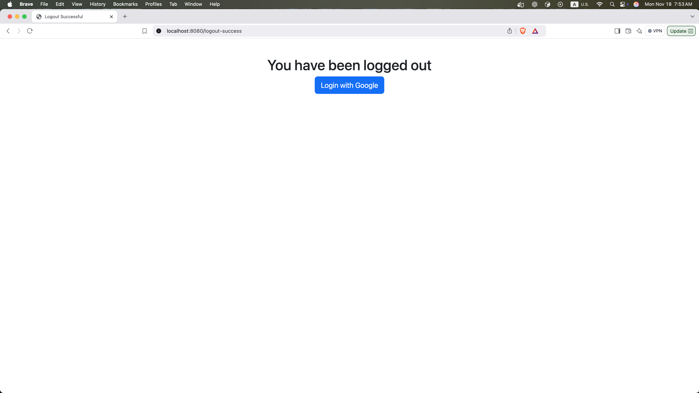
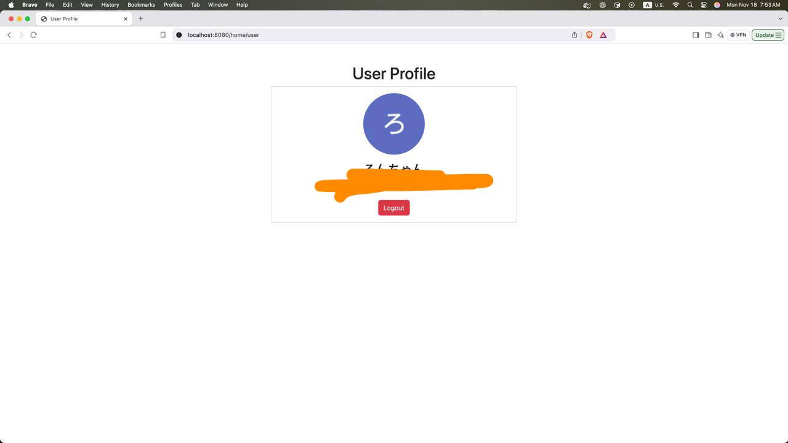
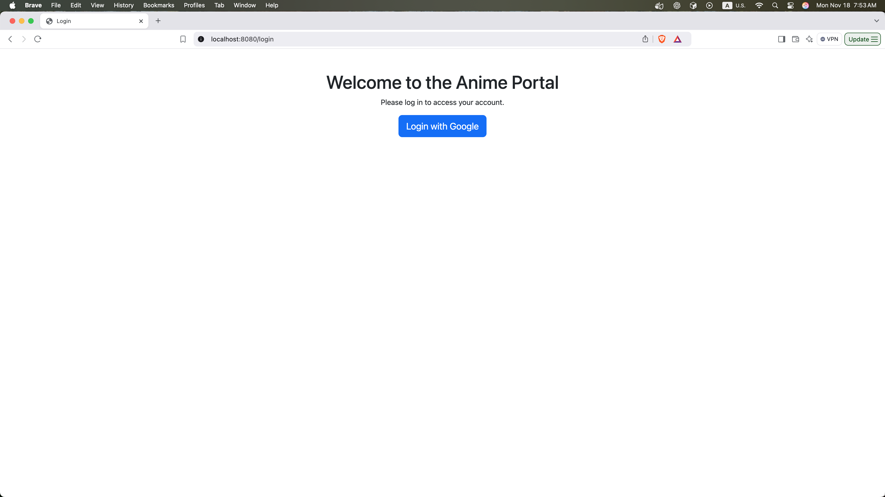
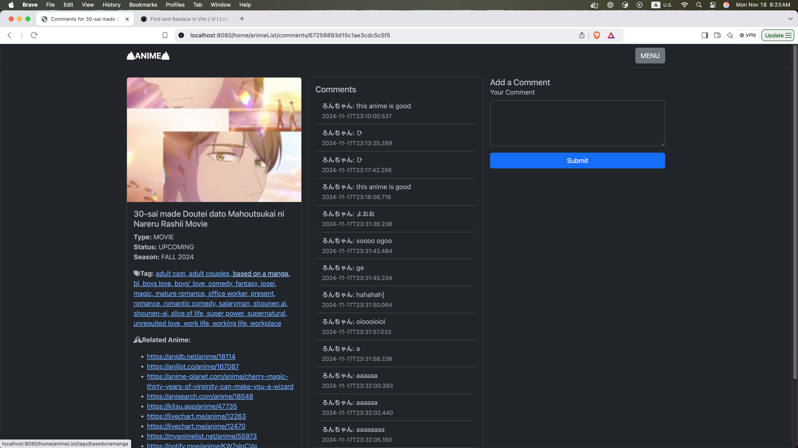
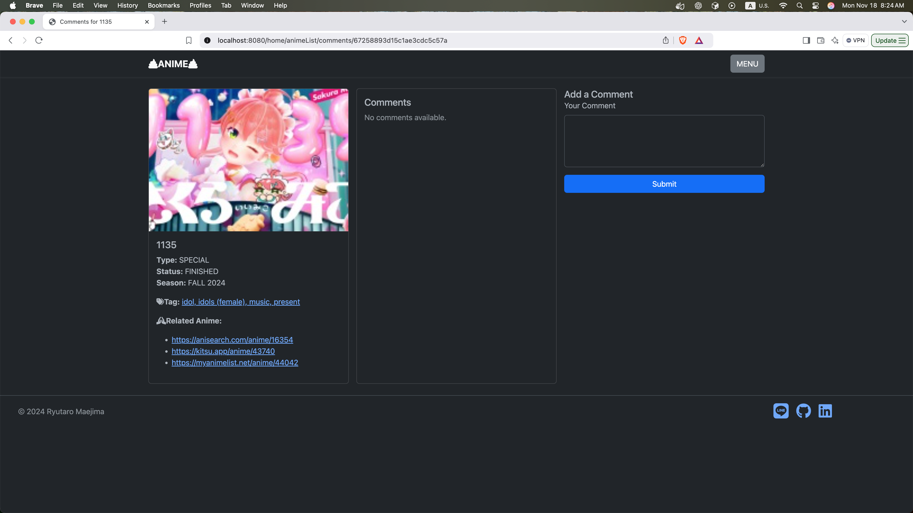
- add google authentication to login and logout 
- create a user
- create comment function

## No.4: 11/28/2024 How Things Are Going
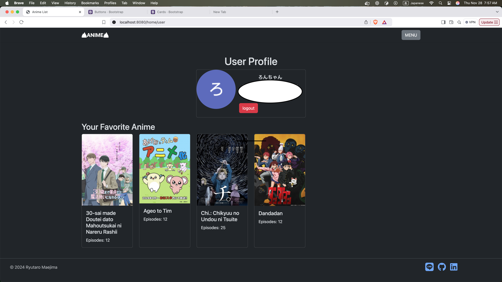
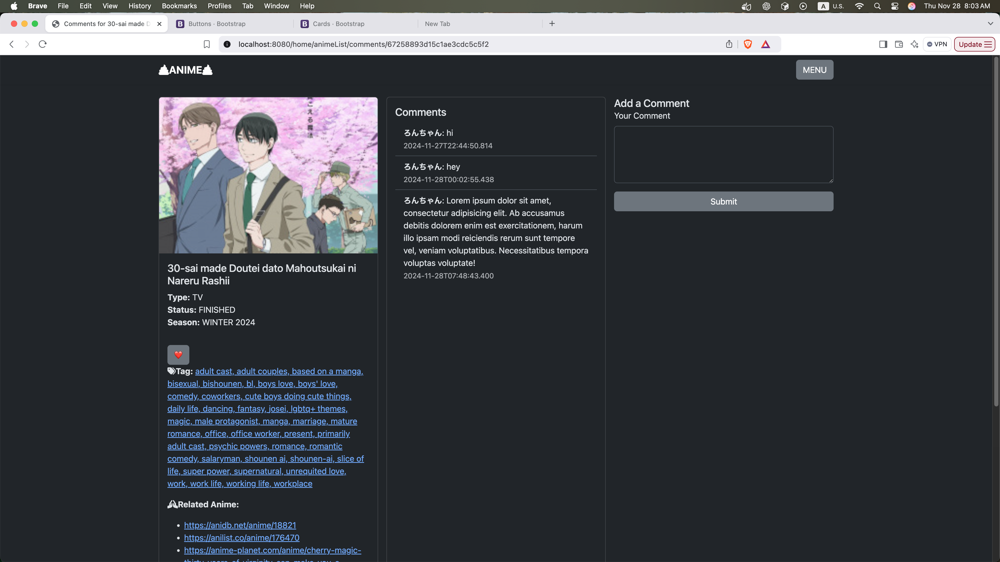
- a user now can save his/her favorite ANIME

